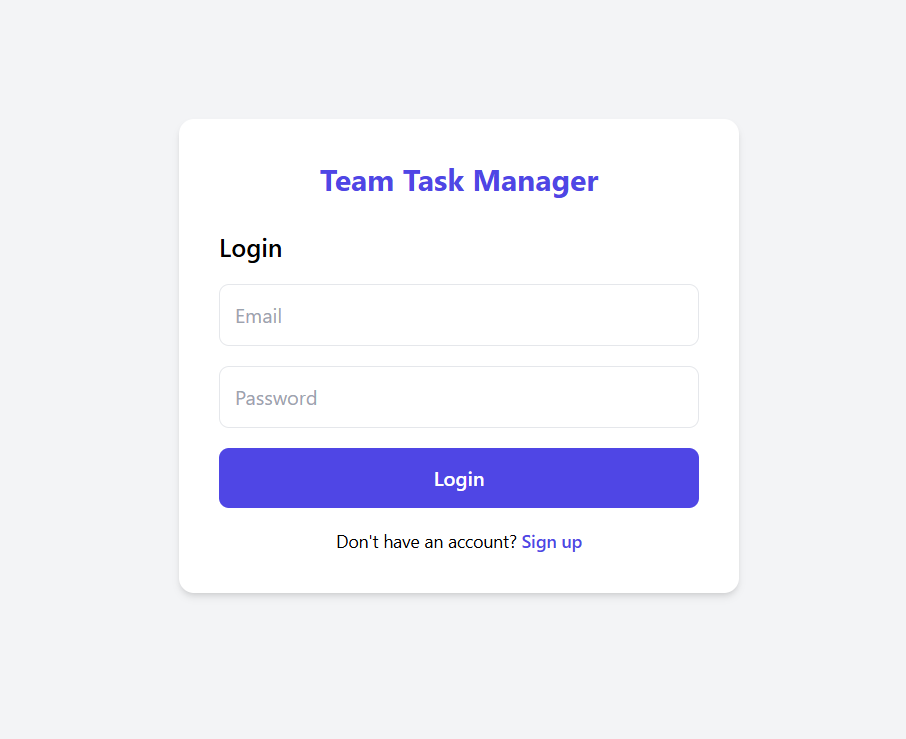
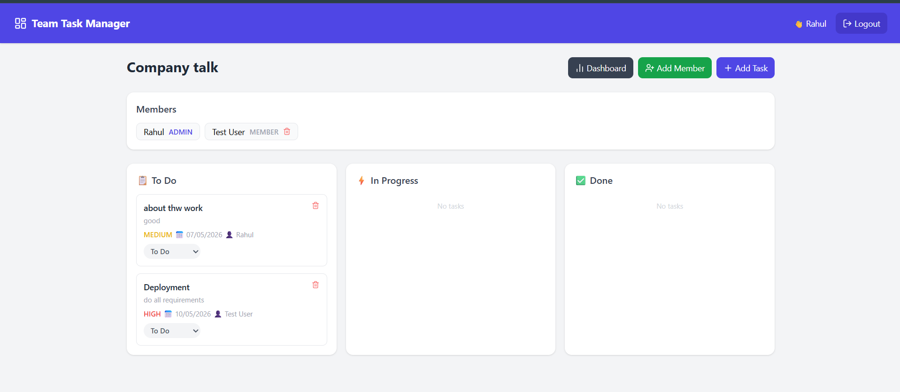
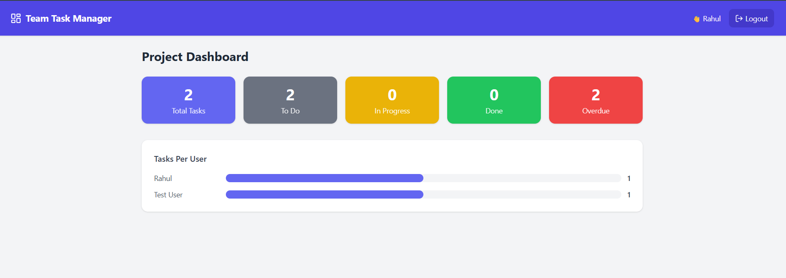

# team-task-manager
A full-stack Team Task Management web app built with React, Node.js, Express, PostgreSQL &amp; Prisma.
A collaborative Team Task Manager where users can create projects, assign tasks, 
and track progress in real-time. Built with role-based access control — 
Admins can manage tasks and members, while Members can view and update their assigned tasks.

# 🚀 Team Task Manager

<div align="center">


[](https://nurturing-prosperity-production-0a1b.up.railway.app)
[](https://github.com/Rahul-2540/team-task-manager)
[](https://team-task-manager-production-1108.up.railway.app)

A **full-stack collaborative Team Task Management** web application — inspired by tools like **Trello** and **Asana**. Built with modern technologies and deployed on Railway.

</div>

---

## 📸 App Screenshots

### 🔐 Login Page


### 📋 Project View — Kanban Board


### 📊 Project Dashboard — Analytics


---

## ✨ Features

### 🔐 Authentication
- Secure **Signup & Login** with JWT tokens
- Passwords hashed with **bcrypt**
- Protected routes with middleware

### 📁 Project Management
- Create and manage multiple projects
- Project creator automatically becomes **Admin**
- Add or remove team members by email
- Role-based access — **Admin** and **Member**

### ✅ Task Management
- Create tasks with **Title, Description, Due Date, Priority**
- Assign tasks to specific team members
- **Kanban-style board** — To Do / In Progress / Done
- Update task status with a single click

### 📊 Dashboard & Analytics
- Total tasks count
- Tasks grouped by status
- Tasks assigned per user with **visual progress bars**
- Overdue tasks tracker

### 🔒 Role-Based Access Control
| Feature | Admin | Member |
|---|---|---|
| Create Tasks | ✅ | ❌ |
| Delete Tasks | ✅ | ❌ |
| Assign Tasks | ✅ | ❌ |
| Add/Remove Members | ✅ | ❌ |
| Update Task Status | ✅ | ✅ (own tasks only) |
| View Project | ✅ | ✅ |

---

## 🛠️ Tech Stack

### Frontend


### Backend


### Database


### Deployment


---

## 🗂️ Project Structure

```
team-task-manager/
├── client/                     # React Frontend
│   ├── src/
│   │   ├── api/                # Axios configuration
│   │   ├── components/         # Reusable components (Navbar)
│   │   ├── context/            # Auth context
│   │   └── pages/
│   │       ├── auth/           # Login & Signup pages
│   │       ├── dashboard/      # Main dashboard
│   │       └── projects/       # Project detail & dashboard
│   ├── tailwind.config.js
│   └── vite.config.js
│
└── server/                     # Node.js Backend
    ├── src/
    │   ├── controllers/        # Business logic
    │   ├── middleware/         # Auth middleware
    │   ├── routes/             # API routes
    │   └── utils/              # Prisma client
    └── prisma/
        └── schema.prisma       # Database schema
```

---

## 🔌 API Endpoints

### Auth Routes
| Method | Endpoint | Description |
|---|---|---|
| POST | `/api/auth/signup` | Register new user |
| POST | `/api/auth/login` | Login user |
| GET | `/api/auth/me` | Get current user |

### Project Routes
| Method | Endpoint | Description |
|---|---|---|
| GET | `/api/projects` | Get all projects |
| POST | `/api/projects` | Create project |
| GET | `/api/projects/:id` | Get project details |
| POST | `/api/projects/:id/members` | Add member |
| DELETE | `/api/projects/:id/members/:memberId` | Remove member |

### Task Routes
| Method | Endpoint | Description |
|---|---|---|
| GET | `/api/projects/:id/tasks` | Get all tasks |
| POST | `/api/projects/:id/tasks` | Create task |
| PUT | `/api/projects/:id/tasks/:taskId` | Update task |
| DELETE | `/api/projects/:id/tasks/:taskId` | Delete task |

### Dashboard Routes
| Method | Endpoint | Description |
|---|---|---|
| GET | `/api/dashboard/:projectId` | Get project stats |

---

## ⚙️ Local Setup

### Prerequisites
- Node.js v18+
- npm
- PostgreSQL database

### 1. Clone the repository
```bash
git clone https://github.com/Rahul-2540/team-task-manager.git
cd team-task-manager
```

### 2. Setup Backend
```bash
cd server
npm install
```

Create `.env` file in `/server`:
```env
DATABASE_URL="your_postgresql_url"
JWT_SECRET="your_jwt_secret"
PORT=5000
```

Run database migrations:
```bash
npx prisma migrate dev --name init
```

Start the server:
```bash
npm run dev
```

### 3. Setup Frontend
```bash
cd client
npm install
```

Create `.env` file in `/client`:
```env
VITE_API_URL=http://localhost:5000/api
```

Start the frontend:
```bash
npm run dev
```

### 4. Open in browser
```
http://localhost:5173
```

---

## 🗄️ Database Schema

```prisma
model User {
  id        String   @id @default(cuid())
  name      String
  email     String   @unique
  password  String
  projectMembers ProjectMember[]
  assignedTasks  Task[] @relation("AssignedTo")
  createdTasks   Task[] @relation("CreatedBy")
}

model Project {
  id          String   @id @default(cuid())
  name        String
  description String?
  members     ProjectMember[]
  tasks       Task[]
}

model ProjectMember {
  role      Role @default(MEMBER)  // ADMIN or MEMBER
  userId    String
  projectId String
}

model Task {
  title        String
  description  String?
  dueDate      DateTime?
  priority     Priority   // LOW, MEDIUM, HIGH
  status       TaskStatus // TODO, IN_PROGRESS, DONE
  projectId    String
  assignedToId String?
}
```

---

## 🚀 Deployment

Both frontend and backend are deployed on **Railway**:

| Service | URL |
|---|---|
| 🌐 Frontend | [nurturing-prosperity-production-0a1b.up.railway.app](https://nurturing-prosperity-production-0a1b.up.railway.app) |
| ⚙️ Backend API | [team-task-manager-production-1108.up.railway.app](https://team-task-manager-production-1108.up.railway.app) |
| 🗄️ Database | Railway PostgreSQL |

---

## 👨‍💻 Author

**Rahul**
- GitHub: [@Rahul-2540](https://github.com/Rahul-2540)

---

<div align="center">

⭐ **If you found this project helpful, please give it a star!** ⭐

Made with ❤️ by Rahul

</div>


